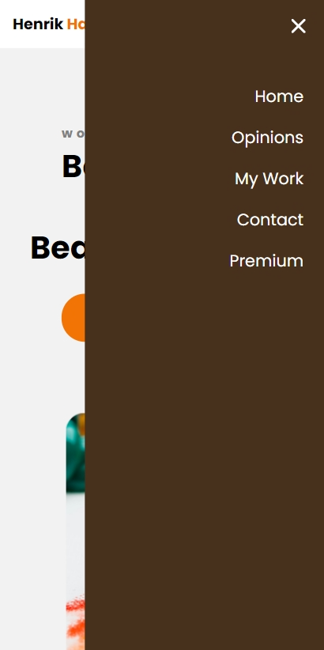
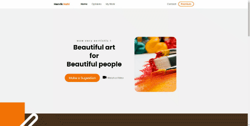

# A Home page for an Artist Painter :art:

<h4 align="center"> 
	🚧   🚧
</h4>

 <a href="#-about">About</a> •
 <a href="#-functionalities">Functionalities</a> •
 <a href="#-layout">Layout</a> • 
 <a href="#-how-to-execute-this-project">How to Execute</a> • 
 <a href="#-technologies">Technologies</a> • 
 <a href="#-made-by">Made By</a> • 
 <a href="#-license">license</a>

## 💻 About

This is a simple template for a landing page of an artist , with testimonials, image gallery a contact and a map to show where the artist is located.

---

## ⚙️ Functionalities

- [x] Mobile Layout
- [x] iframe google map
- [ ] working contact section

---

## 🎨 Layout

### Mobile

  

  

### Web

  

---

## How to Execute this Project

Opening this project with VScode just use the [Live Server](http://https://marketplace.visualstudio.com/items?itemName=ritwickdey.LiveServer) extension to view a developer version in your browser.

Use the [Live Sass Compiler](http://https://marketplace.visualstudio.com/items?itemName=ritwickdey.live-sass) to change the scss file, it will transpile the code into the main.css.

---

## 🛠 Technologies

This is a simple project, it uses simple HTML, Javascript and Sass .

---

## 🦸 Made By

<a>
 
  
 <b>Arthur CBP</b></a> 
  

---

## 📝 License

licença [MIT](./LICENSE).

Made by Arthur 👋🏽 [contatc](https://www.linkedin.com/in/arthurcbp/)
